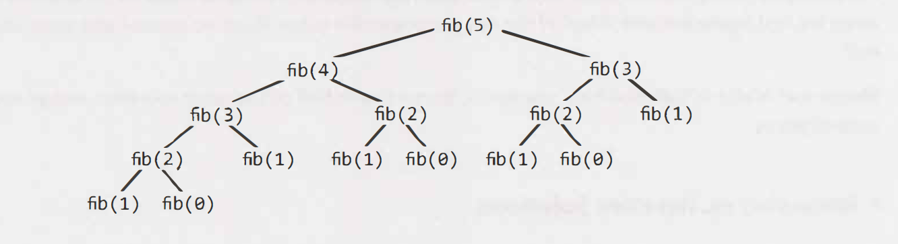
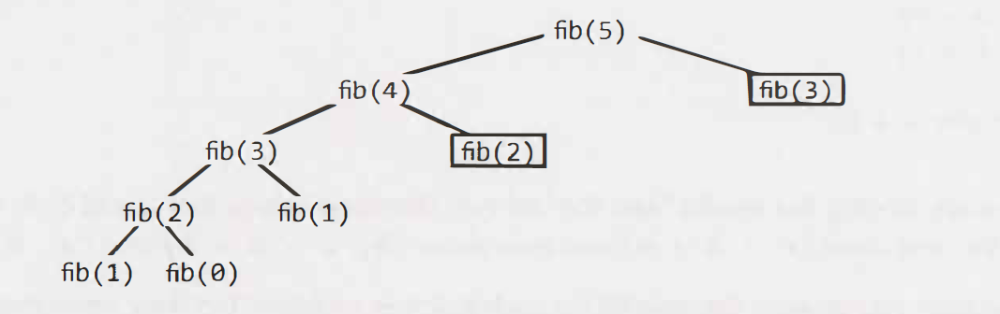

# Recursion and Dynamic Programming

When you hear a problem beginning with the following statements, it's often (though not always) a good candidate for recursion: "Design an algorithm to compute the nth ...", "Write code to list the first n ...", "Implement a method to compute all..", and so on.


## How to Approach

Recursive solutions, by definition, are built off of solutions to subproblems. There are many ways you might divide a problem into subproblems. Three of the most common approaches to develop an algorithm are:

- bottom-up
- top-down
- half-and-half


## Recursive vs. Iterative Solutions

Recursive algorithms can be very space inefficient. Each recursive call adds a new layer to the stack, which means that if your algorithm recurses to a depth of n, it uses at least O(n) memory.

For this reason, it's often better to implement a recursive algorithm iteratively. All recursive algorithms can be implemented iteratively, although sometimes the code to do so is much more complex.


## Dynamic Programming & Memoization

Dynamic programming is mostly just a matter of taking a recursive algorithm and finding the overlapping subproblems (that is, the repeated calls). You then cache those results for future recursive calls.

One of the simplest examples of dynamic programming is computing the nth Fibonacci number.

### Fibonacci Numbers

#### 1 Recursive

```java
int fibonacci(int i) {
	if (i == 0) return 0;
	if (i == 1) return 1;
	return fibonacci(i - 1) + fibonacci(i - 2);
}
```

Let's analyze the runtime. Hints: it's not `O(n)` or `O(n^2)` !

Drawing the recursive calls as a tree is a great way to figure out the runtime of a recursive algorithm.



The total number of nodes in the tree will represent the runtime, since each call only does `O(1)` work outside of its recursive calls. Therefore, the number of calls is the runtime.

The root node has two children. Each of those children has two children (so four children total in the "grandchildren" level). Each of those grandchildren has two children, and so on. If we do this n times, we'll have roughly `O(2^n)` nodes. This gives us a runtime of roughly `O(2^n)`.

We should look for a way to optimize this.


#### 2 Top-Down Dynamic Programming (or Memoization)

With just a small modification, we can tweak this function to run in `O(n)` time. We simply cache the results of fibonacci(i) between calls.

```java
int fibonacci(int n) {
	return fibonacci(n, new int[n + 1]);
}

int fibonacci(int i, int[] memo) {
	if (i == 0 || i == 1) return i;
	if (memo[i] == 0) {
		memo[i] = fibonacci(i - 1, memo)+ fibonacci(i - 2, memo);
	}
	return memo[i];
}
```



We might notice that the tree now just shoots straight down, to a depth of roughly `n`. Each node of those nodes has one other child, resulting in roughly `2n` children in the tree. This gives us a runtime of `O(n)`.


#### 3 Bottom-Up Dynamic Programming

```java
int fibonacci(int n) {
	if (n == 0) return 0;
	else if (n == 1) return 1;
	int[] memo new int[n];
	memo[0] = 0;
	memo[1] = 1;
	for (int i = 2; i < n; i++) {
		memo[i] = memo[i - 1] + memo[i - 2];
	}
	return memo[n - 1] + memo[n - 2];
}
```

If you really think about how this works, you only use `memo[i]` for `memo[i+1]` and `memo[i+2]`. You don't need it after that. Therefore, we can get rid of the memo table and just store a few variables.

```java
int fibonacci(int n) {
	if (n == 0) return 0;
	int a = 0;
	int b = 1;
	for (int i = 2; i < n; i++) {
		int C = a + b;
		a = b;
		b = c;
	}
	return a + b;
}
```

