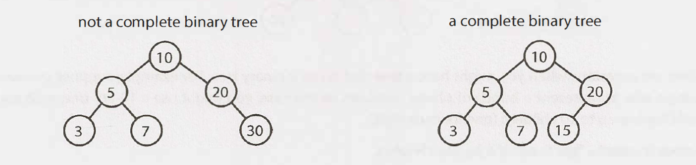
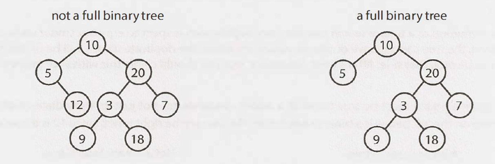
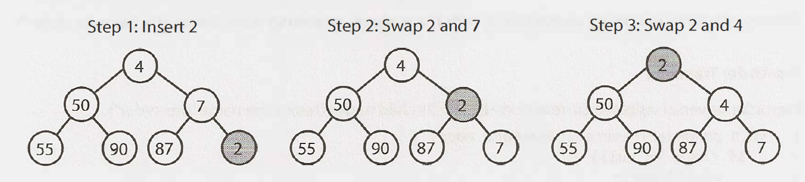
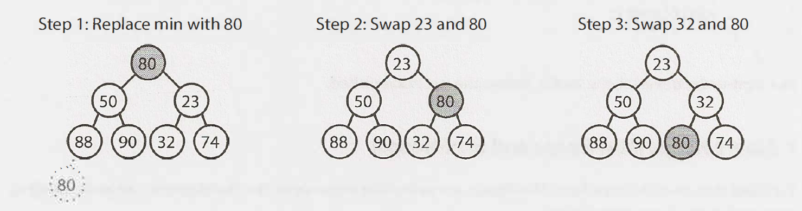
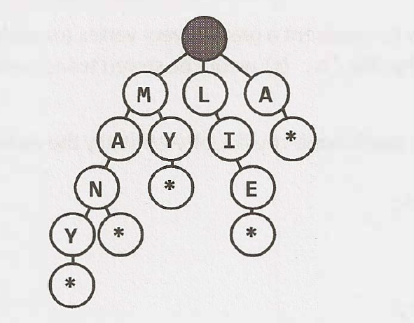
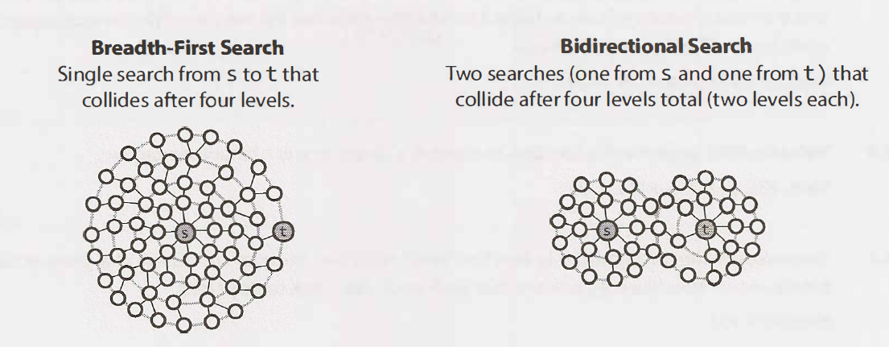

# Trees and Graphs

## Types of  Trees

### A tree is a data structure composed of nodes

- Each tree has a root node. (Actually, this isn't strictly necessary in graph theory, but it's usually how we use trees in programming, and especially programming interviews.)
- The root node has zero or more child nodes.
- Each child node has zero or more child nodes, and so on.

*Tree and graph questions are rife with ambiguous details and incorrect assumptions. Be sure to watch out for the following issues and seek clarification when necessary.


### Binary Trees vs Binary Search Trees

A binary search tree is a binary tree in which every node fits a specific ordering property: all left descendents <= n < all right descendents.


### Balanced vs. Unbalanced

- Note that balancing a tree does not mean the left and right subtrees are exactly the same size.
- One way to think about it is that a "balanced" tree really means something more like "not terribly imbalanced.
- It's balanced enough to ensure `O(logn)` times for insert and find, but it's not necessarily as balanced as it could be.


### Complete Binary Trees

A complete binary tree is a binary tree in which every level of the tree is fully filled, except for perhaps the last level. To the extent that the last level is filled, it is filled left to right.




### Full Binary Trees

A full binary tree is a binary tree in which every node has either zero or two children. That is, no nodes have only one child.




### Perfect Binary Trees

A perfect binary tree is one that is both full and complete. All leaf nodes will be at the same level, and this level has the maximum number of nodes.


## Binary Tree Traversal

### In-Order Traversal

left -> center -> right

```java
void inOrderTraversal(TreeNode node) {
	if (node!= null) {
        inOrderTraversal(node.left);
        visit(node);
        inOrderTraversal(node.right);
    }
}
```

When performed on a binary search tree, it visits the nodes in ascending order (hence the name "in-order").


### Pre-Order Traversal

center -> left -> right

```java
void preOrderTraversal(TreeNode node) {
    if (node!= null) {
        visit(node);
        preOrderTraversal(node.left);
        preOrderTraversal(node.right);
    }
}
```


### Post-Order Traversal

left -> right -> center

```java
void postOrderTraversal(TreeNode node) {
    if (node!= null) {
        postOrderTraversal(node.left);
        postOrderTraversal(node.right);
        visit(node);
    }
}
```


## Binary Heaps (Min-Heaps and Max-Heaps)

A min-heap is a complete binary tree (that is, totally filled other than the rightmost elements on the last level) where each node is smaller than its children.

### Insert



This takes `O(logn)` time, where n is the number of nodes in the heap.


### Extract Minimum

- remove the head and swap the last element in the heap to the head
- bubble down this element



This also takes `O(logn)` time.


## Tries (Prefix Trees)

A trie is a variant of an n-ary tree in which characters are stored at each node. Each path down the tree may represent a word.




Very commonly, a trie is used to store the entire (English) language for quick prefix lookups. While a hash table can quickly look up whether a string is a valid word, it cannot tell us if a string is a prefix of any valid words. A trie can do this very quickly.


How quickly? A trie can check if a string is a valid prefix in `O(K)` time, where `K` is the length of the string. This is actually the same runtime as a hash table will take. Although we often refer to hash table lookups as being `O(1)` time, this isn't entirely true. A hash table must read through all the characters in the input, which takes `O(K)` time in the case of a word lookup.


## Graphs

A graph is simply a collection of nodes with edges between (some of) them.


### Adjacency List

Every vertex (or node) stores a list of adjacent vertices. In an undirected graph, an edge like (a, b) would be stored twice: once in a's adjacent vertices and once in b's adjacent vertices.

```java
class Graph {
	public Node[] nodes ;
}
class Node {
	public String name;
	public Node[] children;
}
```

The Graph class is used because, unlike in a tree, you can't necessarily reach all the nodes from a single node.


### Adjacency Matrices

An adjacency matrix is an `NxN ` boolean matrix (where `N ` is the number of nodes), where a true value at `matrix[i][j]` indicates an edge from node `i` to node `j`. (You can also use an integer matrix with 0s and 1s.)

In an undirected graph, an adjacency matrix will be symmetric. In a directed graph, it will not (necessarily) be.


### Graph Search-DFS

Pre-order and other forms of tree traversal are a form of DFS. The key difference is that when implementing this algorithm for a graph, we must check if the node has been visited. If we don't, we risk getting stuck in an infinite loop.


```java
void search(Node root) {
    if (root== null) return;
    visit(root);
    root.visited= true;
    for each (Node n in root.adjacent) {
    	if (n.visited == false) {
    		search(n);
    	}
    }
}
```


### Graph Search-BFS

```java
void search(Node root) {
    Queue queue = new Queue();
    root.marked= true;
    queue.enqueue(root); // Add to the end of queue
    while (!queue.isEmpty()) {
    	Node r = queue.dequeue(); // Remove from the front of the queue
    	visit(r);
    	foreach (Node n in r.adjacent) {
    		if (n.marked == false) {
    			n.marked = true;
    			queue.enqueue(n);
    		}
    	}
    }
}
```


### Graph Search-Bidirectional Search

Bidirectional search is used to find the shortest path between a source and destination node. It operates by essentially running two simultaneous breadth-first searches, one from each node. When their searches collide, we have found a path.




To see why this is faster, consider a graph where every node has at most `k `adjacent nodes and the shortest path from node `s` to node `t` has length `d`. 

- In traditional breadth-first search, we would search up to `k` nodes in the first "level" of the search. In the second level, we would search up to k nodes for each of those first `k` nodes, so `k^2` nodes total (thus far). We would do this d times, so that's `O(kd)` nodes.
- In bidirectional search, we have two searches that collide after approximately `d/2` levels (the midpoint of the path). The search from `s` visits approximately `k^d/2`, as does the search from `t`. That's approximately `2 kd/2`, or `O(k^d/2)`, nodes total.

The bidirectional search is actually faster by a factor of `k^d/2`

