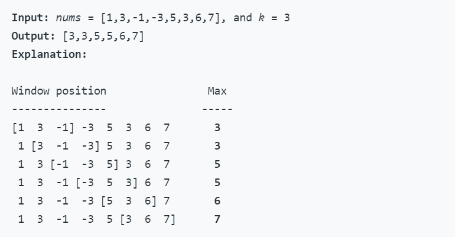

# Interview Questions 2 (LeetCode 239 Hard)

## Description

Given an array *nums*, there is a sliding window of size *k* which is moving from the very left of the array to the very right. You can only see the *k* numbers in the window. Each time the sliding window moves right by one position. Return the max sliding window.

**Example**:




## Solution (Time O(n), Space O(k))

**Using Deque** to maintain a decreasing subsequence of the window.

Three operations in each iteration:

1. Pop front: when the front element is out of window range, pop it;
2. Pop back: when the back element is smaller than the current element, pop it (maintain the decreasing order);
3. Push back: Push the current element after the above operations.


## Code

```python
class Solution(object):
    def maxSlidingWindow(self, nums, k):
        """
        :type nums: List[int]
        :type k: int
        :rtype: List[int]
        """
        deque = [] # maintain a decreasing deque
        res = []
        
        for i in range(len(nums)):
            if len(deque) != 0 and deque[0] == i-k: 
                # pop the out-of-window element
                del deque[0]
            while len(deque) != 0 and nums[deque[-1]] < nums[i]:
                # pop the element that's not possible to be the max num
                del deque[-1]
            deque.append(i)
            if i >= k-1: 
                # retreat the max num when reach the first full window
                res.append(nums[deque[0]])
        return res
```

