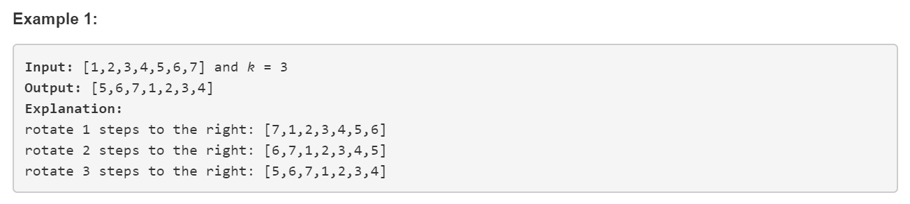

# Interview Questions 4 (LeetCode 189 Easy)

## Description

Given an array, rotate the array to the right by *k* steps, where *k* is non-negative.



## Solution 1 Naive Solution (Time O(n), Space O(1))

Add the last element to the front and then delete the last element. It takes k*n ops.

### Code

```python
class Solution(object):
    def rotate(self, nums, k):
        """
        :type nums: List[int]
        :type k: int
        :rtype: void Do not return anything, modify nums in-place instead.
        """
        # Solution 1: Naive Solution, O(1) space, O(N) time, k*N comparison
        for i in range(k):
            nums.insert(0,nums[-1])
            del nums[-1]
```


## Solution 2 Pythonic Solution (Time O(1), Space O(n))

### Code

```python
class Solution(object):
    def rotate(self, nums, k):
        """
        :type nums: List[int]
        :type k: int
        :rtype: void Do not return anything, modify nums in-place instead.
        """
        
        # Solution 2: Pythonic, but not O(1)
        n = len(nums)
        nums[:] = nums[n-k:]+nums[:n-k] # nums[:] for inplace
```


## Solution 3 Brilliant (Time O(n), Space O(1))

- Requirement
  nums = "----->-->"; 
  result = "-->----->";

- Solution

  reverse "----->-->" we can get "<--<-----"
  reverse "<--" we can get "--><-----"
  reverse "<-----" we can get "-->----->"

- It only takes 3*n ops.

### Code

```python
class Solution(object):
    def rotate(self, nums, k):
        """
        :type nums: List[int]
        :type k: int
        :rtype: void Do not return anything, modify nums in-place instead.
        """
        
        # Solution 3: Brilliant, O(1) space, O(N) time, 2*N comparison
        def reverse(nums, start, end):
            while start < end:
                nums[start], nums[end] = nums[end], nums[start]
                start += 1
                end -= 1
                
        n = len(nums)
        k = k % n
        reverse(nums,0,n-1)
        reverse(nums,0,k-1)
        reverse(nums,k,n-1)
```

